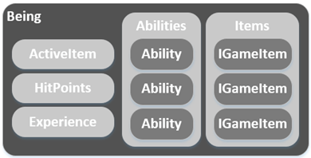
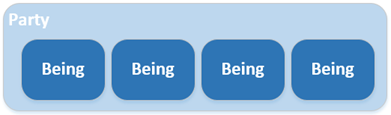
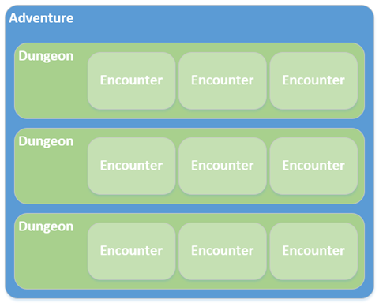

# Welcome to OSRlib.NET!

OSRlib.NET is a .NET Core class library written in C# that provides an API for turn-based role-playing games (RPGs) in the [Old School Renaissance](https://en.wikipedia.org/wiki/Old_School_Renaissance) (OSR) style.

It's designed for use as the core rules engine of a computer role-playing game (CRPG) in the Dungeons & Dragons Basic/Expert (or *B/X*) flavor, and lends itself well to Bard's Tale-style turn-based game play.

Add your own UI to interact with the OSRlib.NET API and you have yourself a turn-based RPG.

## Object model

The object model of OSRlib is intended to be simple and intuitive. The following sections describe the primary classes and their relationships.

### Being

A [Being](/api/osrlib.Core.Being.html) is any living entity that can initiate interaction with another entity within the game world, or can be interacted with by another Being. Player characters (PCs), non-player characters (NPCs), and monsters are all **Beings**.

### Party

A [Party](/api/osrlib.Core.Party.html) is a collection of **Beings**. Two Party objects are added to an [Encounter](#adventure-dungeon--encounter), whose Beings can then battle.

### Adventure, Dungeon, & Encounter

An [Adventure](/api/osrlib.Core.Adventure.html) consists of one or more [Dungeons](/api/osrlib.Core.Dungeon.html). Each Dungeon is comprised of one or more [Encounters](/api/osrlib.Core.Encounter.html).

An Encounter is typically populated with a monster [Party](#party). Adding a player Party to the Encounter starts the Encounter (begins the battle).

